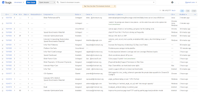
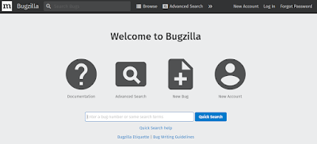

### What is Open Source 

Open source is a source code for software people can use for free. Users can freely take the source code, modify it, and distribute their versions of the program. Open-source software is released through a specific kind of licenses such as Apache License 2.0, Massachusetts Institute of Technology license (MIT license), Berkeley Software Distribution license (BSD), and Mozilla Public License 2.0 (MPL 2.0). Each license has rules users must follow. For example, if users want to use an open-source software released through MPL 2.0 license, they must include copyright, license, and original. Also, they must disclose the source. In comparison, when they want to use open-source software released through BSD, they must include only copyright and license.
As one of the advantages of open source is many people can contribute to the open-source software to improve the functionality, open-source software has their ways to get feedback to patch their software. This posting will show two representative open source software and the process of patches: Chromium and Mozilla Firefox

### Chromium

Chromium is a free and open-source web browser project developed by Google. This project includes Chromium and Chromium OS. It uses a BSD license (Berkeley Software Distribution license) that users are available to modify, distribute, and commercially use it but they cannot use the trademark and hold liable. If they want to use this open-source software, they must include copyright and license. They provide the official Chromium GitHub mirror repository (https://github.com/chromium/chromium). There are 851,825 commits, 7 branches, and 17,606 releases. It displays there are infinite contributors because it is GitHub’s Linux Kernel mirror.

Chromium gets issues through a website https://bugs.chromium.org/p/chromium/issues/list. When you click the “New Issue” button, it asks you to log in Google account. After you have explained a general description of the issue, you can submit your issue. Chromium team will review your issue and if it needs to fix, they will approve to fix the patch. Chromium aims to respond within 24 hours of receipt. When they accept the issue, one of 44 committers will review the code.
The advantage of this issuing is people can easily use it. If they have a Google account, they can post a new issue. They do not need technical knowledge to add a new issue. However, if people do not want to create a Google account, they cannot add an issue. Besides, there is no “Resolved” status on this webpage. Users do not know the previous patches using this page.

### Mozilla Firefox

Mozilla Firefox is a free and open-source web browser developed by the Mozilla Foundation and its subsidiary, Mozilla Corporation. It uses MPL 2.0 license (Mozilla Public License 2.0) that users are available to modify, distribute, and commercially use it. Also, they can place a warranty and use patent claims. However, they cannot use the trademark and held liable. They must include copyright, license, and original. Furthermore, they must disclose the source.

Mozilla accepts patches from contributors through Bugzilla (https://bugzilla.mozilla.org/home
) which is the de-facto standard in open-source bug-tracking to create a quality product. All changes are fully documented in this website and a specific patch posted directly to the bug report. Mozilla trains reviewers for months or years to contribute by testing both the actual functionality of the patch and inspect the code for quality. Once code review is done, four people who are leaders of the Bugzilla project review the code and grant whether the patches are granted or not. It usually spends 1 month to 7 months to close the bug.
The advantage of this process is the efficiency of usage. Users can look at all bug reports included previous patches and recent issues. However, it is hard to use in a first glance.

Particular patches for each open source
- Chromium: https://bugs.chromium.org/p/chromium/issues/detail?id=1041569&q=status%3DUnconfirmed&colspec=ID%20Pri%20M%20Stars%20ReleaseBlock%20Component%20Status%20Owner%20Summary%20OS%20Modified
- Mozilla Firefox: https://bugzilla.mozilla.org/show_bug.cgi?id=1598201

Websites I looked up
- [https://bugs.chromium.org/p/chromium/issues/][Chromium Bugs]
- [https://www.chromium.org/][Chromium]
- [https://tldrlegal.com/][Licences]
- [https://bugzilla.mozilla.org/home][Bugzilla]
- [https://wiki.mozilla.org/][Mozilla Wiki]